
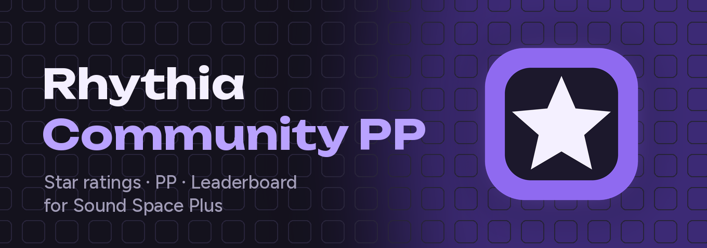

<h3 align="center">Community star ratings, PP and leaderboards for Rhythia: Nightly and Rewrite</h3>

  <a href="https://coleecvr.github.io/rhythia-pp/"><b>🌐 Open the website</b></a>
  &nbsp;·&nbsp;
  <a href="https://discord.gg/YwrN6EmSZj"><b>💬 Join the Discord</b></a>
  &nbsp;·&nbsp;
  <a href="UPDATES.md"><b>✨ What's new</b></a>

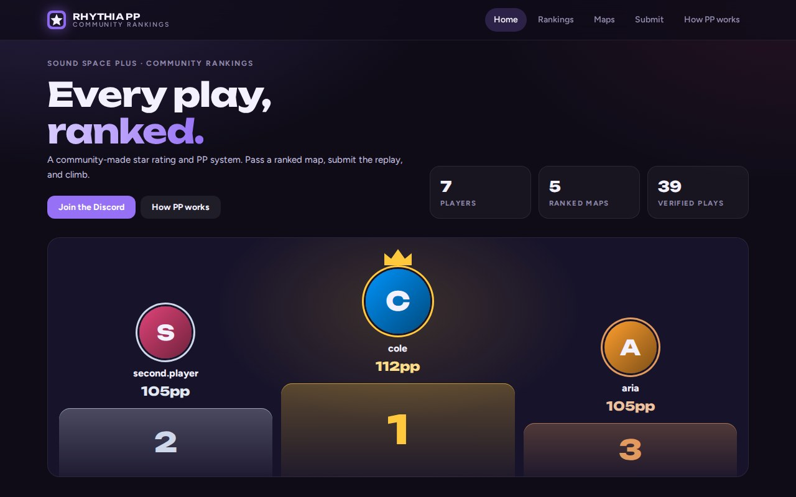

## What is this?

Rhythia is a free rhythm game where you steer a cursor into notes flying toward you. It has two open-source clients:
**Nightly**, the latest and final Sound Space Plus ([Rhythia/sound-space-plus](https://github.com/Rhythia/sound-space-plus)),
and **Rewrite**, the new client in active development ([Rhythia/Client](https://github.com/Rhythia/Client)).
**Rhythia Community PP** gives both one shared, replay-backed ranking: every map gets a **star rating**, every pass
earns **PP** (performance points), and your best plays add up to your spot on the **leaderboard**, whichever client you
play on.

It's made by a player, for players, and it isn't an official part of Rhythia.

## Getting on the leaderboard

1. **Pass a ranked map** in Nightly or Rewrite. Curators choose them; the website's Maps page lists them.
2. **Find the replay.** On Windows, paste `%APPDATA%\SoundSpacePlus\replays` (Nightly) or `%APPDATA%\Rhythia\replays`
   (Rewrite) into the File Explorer address bar and pick the newest file for that map.
3. **Send it in the [Discord](https://discord.gg/YwrN6EmSZj):** in the bot commands channel, run `/submit` and attach the replay.
   If the bot doesn't know the map, run it again with the map file in the **map** option.

The bot replies with a card: verified (your PP and new rank), held for review (a curator checks it and the bot messages
you), or not counted, with why and what to do. Your first play signs you up: your Discord account is your leaderboard
account. The website catches up a minute or two later.

## The website

<table>
  <tr>
    <td width="50%">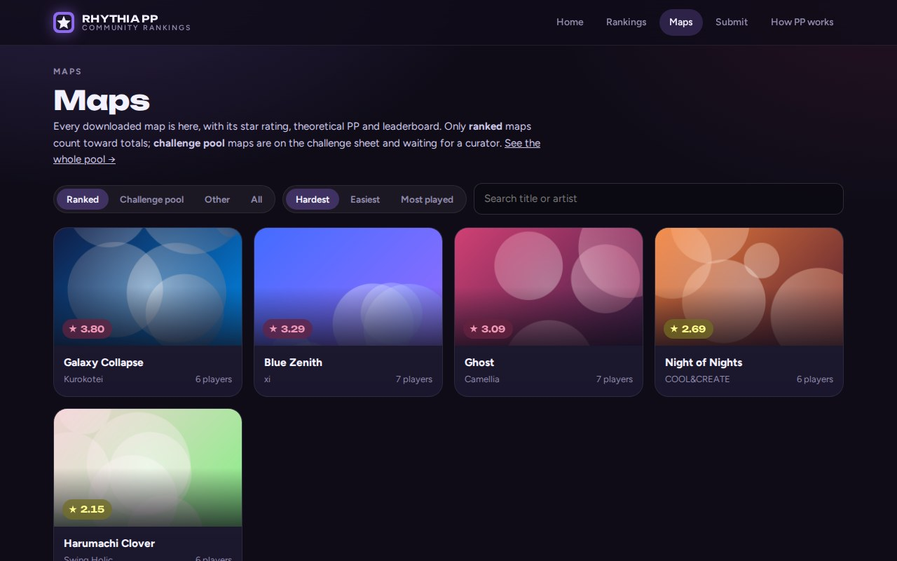 <b>Every map, rated.</b> Star ratings, the PP a full combo is worth, and a leaderboard for each map.</td>
    <td width="50%">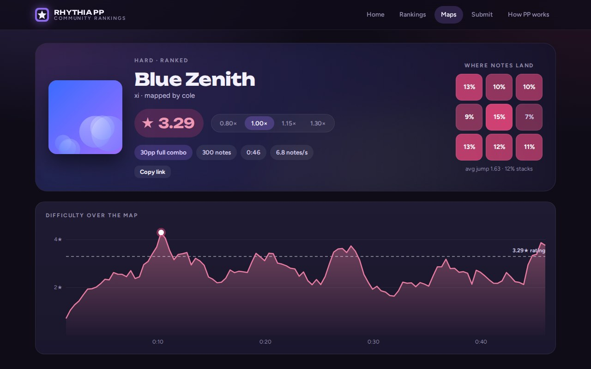 <b>Map pages</b> show where the notes land and how the difficulty rises and falls through the song.</td>
  </tr>
  <tr>
    <td width="50%">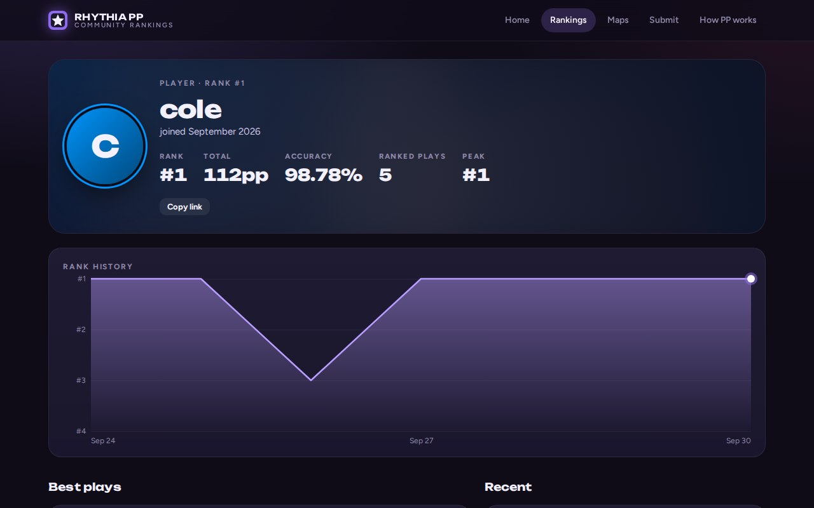 <b>Player pages</b> with rank history, best plays and recent plays.</td>
    <td width="50%">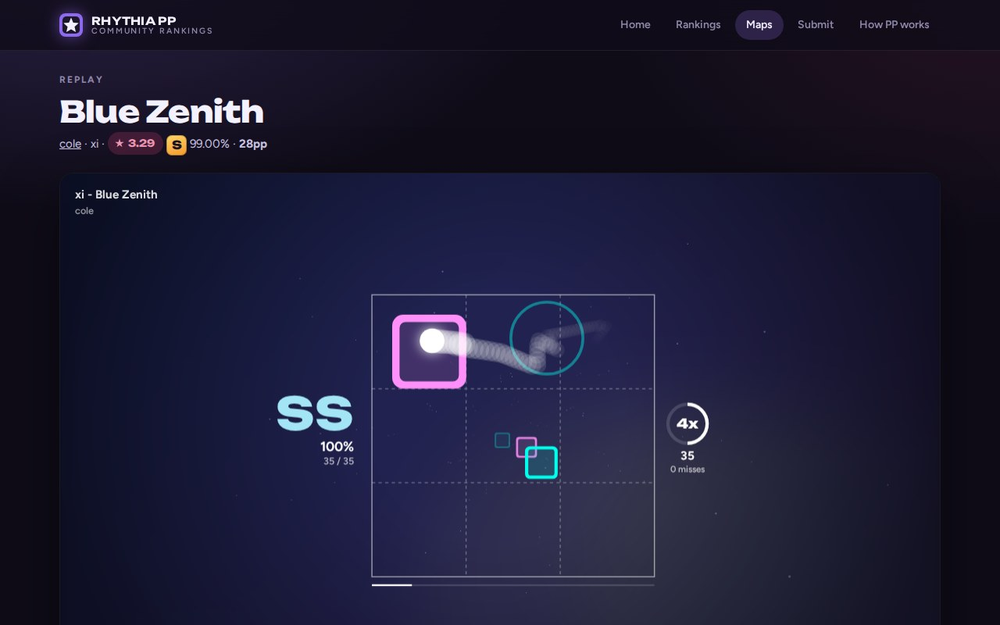 <b>Watch any play</b> in a replay viewer that looks like the game. Add your copy of the map to hear the song.</td>
  </tr>
  <tr>
    <td width="50%">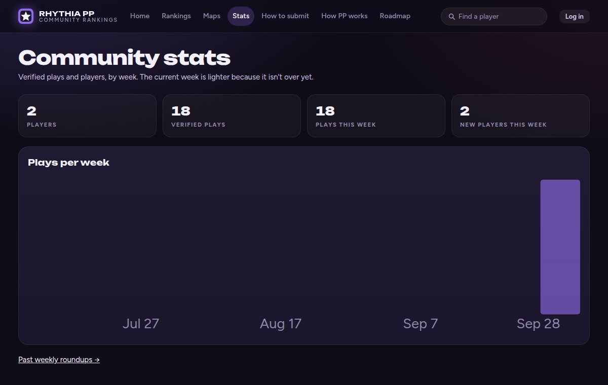 <b>Community stats</b>: plays and players by week, and by client.</td>
    <td width="50%">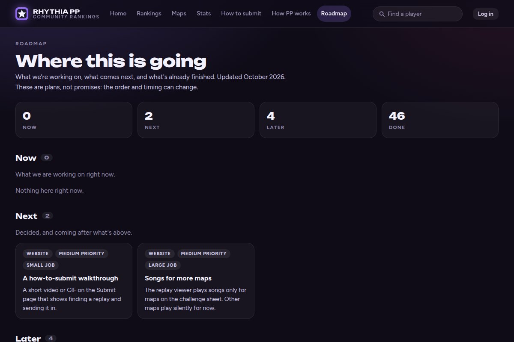 <b>The roadmap</b>: what is being worked on, what comes next, and what is already live.</td>
  </tr>
</table>

Share any map, player or play: the **Copy link** button makes a link that shows a preview card when you paste it in
Discord.

## In the Discord

The bot scores your plays the moment you send them and makes a card for every result. It also announces new #1s and
top plays, keeps the ranked map list, and gives out roles as you climb.

<table>
  <tr>
    <td width="50%">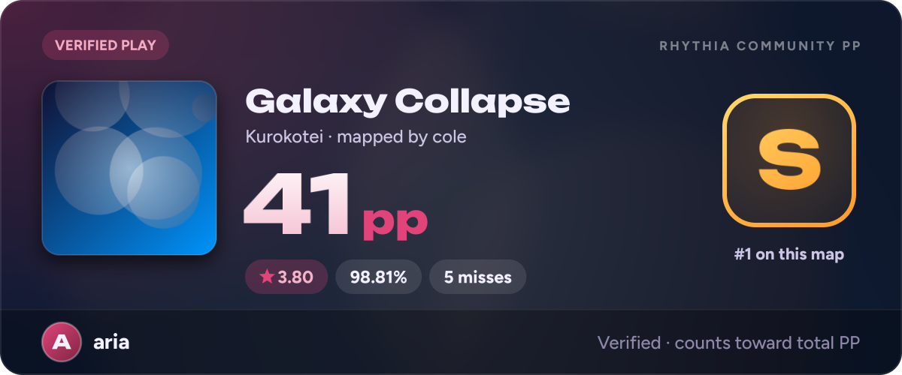 <b>Every play gets a card</b> with its PP, accuracy and grade.</td>
    <td width="50%">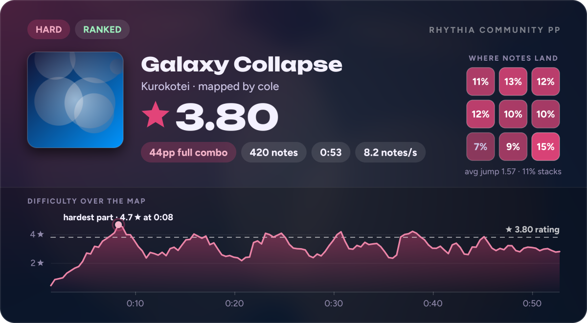 <b>Map cards</b> show a map's rating and where it gets hard.</td>
  </tr>
  <tr>
    <td width="50%">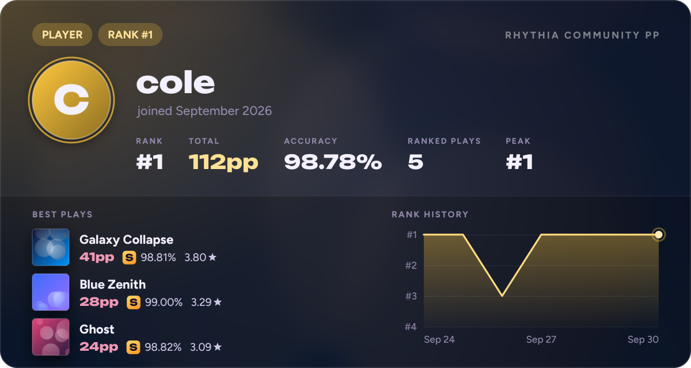 <b>Your profile</b> with your rank history and best plays.</td>
    <td width="50%"> <b>Plus:</b> a weekly roundup, celebrations for new ranks and milestones, and curator tools for choosing ranked maps.</td>
  </tr>
</table>

Screenshots show sample players.

## How PP works, briefly

- **Stars** measure how hard a map is to play: how far and how fast you have to move, and how sharply you change
  direction. Speed changes the map, so a play at 115% is rated on the map at 115%, and plays show their speed the way
  their game does (Nightly's `<` button is 87%).
- **PP for a play** comes from the map's stars and your accuracy. A 5★ full combo is worth 120pp, harder maps are
  worth much more. Every miss costs, and the gap to a full combo grows steadily, so long maps don't hide misses.
- **Your total** adds up your best play on each ranked map: your best counts in full, the next 95%, then about 90%,
  and so on.

## Keeping it fair

Every replay is re-checked before it counts. It has to be a real pass of the exact ranked map with allowed settings,
and the recorded cursor has to actually touch every note it claims to hit. Anything that looks automated is held for
a person to check, never banned automatically.

Only **ranked** maps give PP, and curators choose them, including picks from the community challenge sheet.
Suggestions are welcome in the Discord.

## Questions

**Is this official?** No. It's a fan project for Rhythia's Nightly and Rewrite clients, not made by or affiliated with
their developers.

**Can anyone join?** Yes. Anyone can join the [Discord](https://discord.gg/YwrN6EmSZj) and use the bot there, and anyone can
look at the website.

**Can I use the bot or the website for my own server?** No. Rhythia Community PP is a private project: the bot only
runs in its own Discord server, and its code isn't shared.

**Where do I report a problem or suggest something?** In the [Discord](https://discord.gg/YwrN6EmSZj).

---

© 2026 coleecvr. All rights reserved. This page shows the project; its code is not published.
